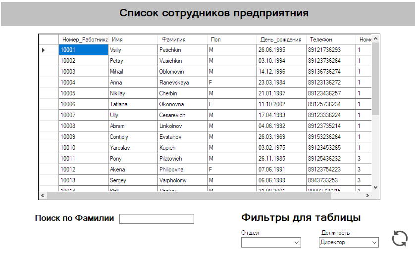
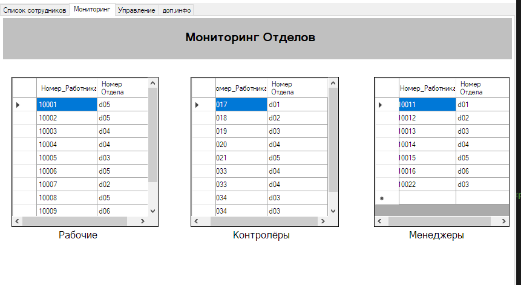
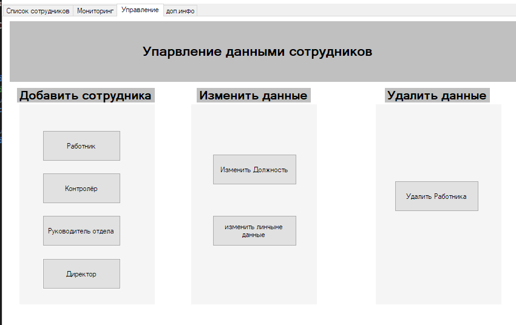

# Deeplay Project
Этот проект представляет собой приложение для управления сотрудниками компании. Оно позволяет добавлять, редактировать, удалять сотрудников, а также изменять их должности и отделы. Приложение взаимодействует с базой данных для хранения информации о сотрудниках, отделах и их ролях.

## Основные функции

- Добавление сотрудников: Добавление новых сотрудников с указанием их личных данных и отдела.
- Изменение данных сотрудников: Редактирование информации о сотрудниках (имя, фамилия, пол, дата рождения, телефон).
- Удаление сотрудников: Удаление сотрудников из базы данных.
- Изменение должностей: Назначение сотрудников на различные должности (работник, контролёр, менеджер, директор).
- Фильтрация сотрудников: Фильтрация сотрудников по фамилии, должности или отделу.
- Дополнительная информация: Получение информации о руководителе отдела, полномочиях контролёра и количестве сотрудников.

## Технологии
- Язык программирования: C#
- Платформа: .NET Framework / .NET Core
- База данных: SQL Server
- Интерфейс: Windows Forms

## Оформление
Меню со списком сотрудников.  
   
Мониторинг отделов.  
   
Управление данными сотрудников.  
    

